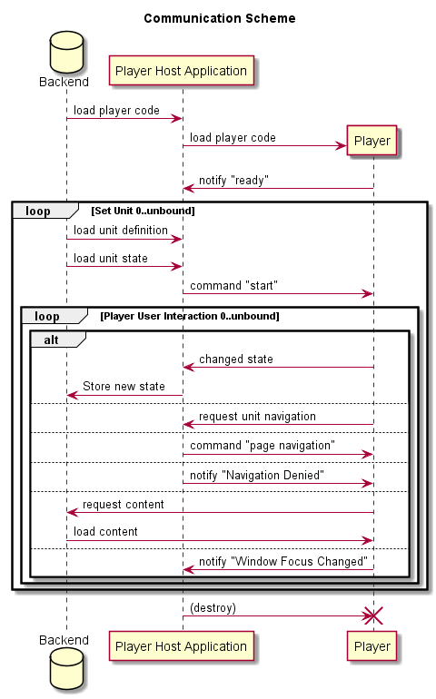

# Verona Player Interface Model

A web-application for online assessment will always have a component that handles the direct 
interaction between the task/unit and the testee/testtaker.

## Use Cases
### Use Case 1: Present 1 Unit

In this case, the unit is loaded and the user can interact with it, but no responses are stored.

This use case applies for:
* Authoring applications: The user requests a preview to evaluate the design and the interaction.
* Item banks, archives: Browsing through the stock of stored units should include a feature to present the unit as used in tests.

### Use Case 2: Show Test

A sequence of units is presented, but responses are stored only for this run. By navigating backwards, given responses are restored, but when the test is started again, the responses will be forgotten. These are not stored permanently. 
   
This use case applies for:
* Review test design or a number of units: The user calls a preview of the test to evaluate the chosen sequence. Some feedback feature might be available.
* Demo: Some people like to learn how the system looks like.

### Use Case 3: Run Test

For this use case, the changing unit states are stored permanently for analyses. If the application breaks and will restart, the former state of the unit will be restored. Furthermore, navigation between units might be triggered by the test application too ("time over"). 

This use case applies for:
* Test applications: The user is the testtaker, e. g. the person to be evaluated. 

### Use Case 4: Response Evaluation 

In this case, an already initialized unit is fed by several testee data (e. g. unit states). The user looks at the given responses and evaluates. 

This use case applies for:
* Coding applications: Open responses cannot be evaluated/coded automatically. A trained coder looks at all responses and decides, which code represents the response best. This is necessary to run any statistical analysis or to report.
* Feedback applications: In order to learn from the reported outcomes, a teacher likes to look at responses of the tested students (replay). 

## Player Communicaton Scheme

Given all these use cases, we focus now on the communication between the player and the application:

* **Backend**: Serverside programming with database, i. e. the persistent layer
* **Player Host Application**: Frontend, i. e. programming run by browser
* **Player**: Rectangular area of the frontend, place of player programming

### Prepare Player
* **load player code**: The player is a piece of code that is loaded on demand. Therefore, the sequence starts with loading the code.
* **notify "ready"**: After the player is loaded, it sends a notification to the application. Any message or command sent by the application before that is useless, because the player does not listen to it yet. As part of the notification, the player reports it's own features to let the host adopt.
 
### Prepare Unit
The point here is ("loop"!), that the player could be the same for the whole test, only the units change. The start command will reset the player with the new unit.
* **load unit definition**: The player must know what it has to show and how the interaction should be
* **load unit state**: (optional) Depending on the use case, already given responses might be loaded on start.
* **start**: Payload of this command consists of the unit definition, former unit state (optional) and some parameters to modify the behaviour of the player (for example presentation mode)

### Interaction
* **changed state**: Every new state is sent to the host. Depending on the use case, the host will ignore the state, store the state temporarily or permanently.
* **request unit navigation**: If the unit definition contains of unit navigation elements ("next"-button), the player let the host know on request.
* **command "page navigation"**: The host might have some elements (buttons) for navigation between pages of the unit. If one of these elements are triggered, the host will command a change of page.
* **notify "Navigation Denied"**: Part of the state of the unit is the progress of giving valid responses. If the host gets a unit navigation request but the progress of responding is insufficient, the request is denied and the player should visualise problems (empty but required form entry).
* **request content**, **load content**: The player is allowed to load content (media, additional code) on runtime. The source is the backend only - for security reasons.
* **notify "Window Focus Changed"**: Depending on the use case, the host might be interested whether the player area has the interaction focus or not. In classroom settings, this could help to detect user misbehaviour.

### Finalise
Every state change is sent to the host immediately. So there is no need to declare or to force the end of the interaction or to finalise the unit somehow. Just drop/discard/empty the player area.
