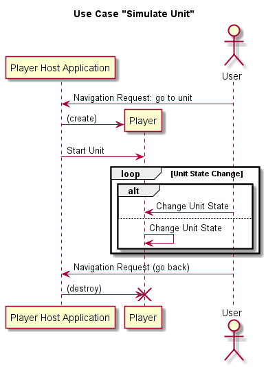
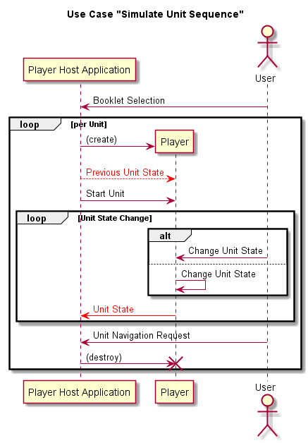
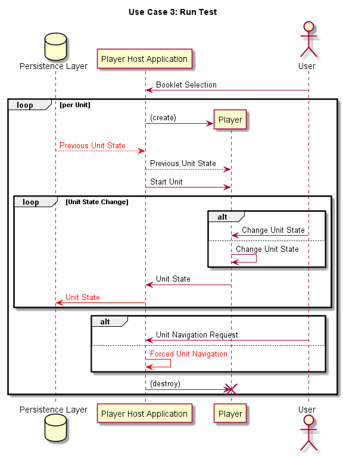
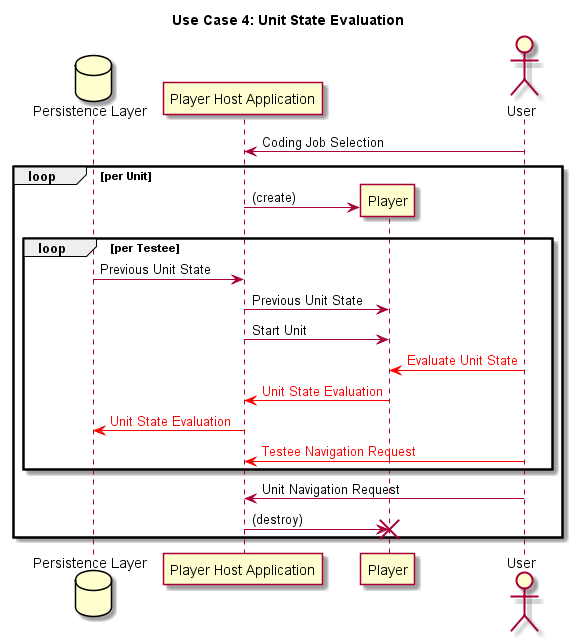
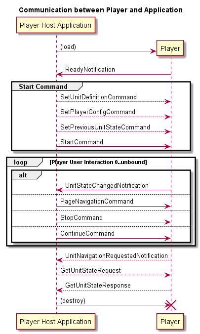

# Verona Player Interface Model

A web-application for online assessment will always have a component that handles the direct 
interaction between the task/unit and the testee/testtaker. This text describes the sequence of interactions for
some use cases. Finally, we focus on the necessary interactions between the player component and the application 
for all use cases.  

## Use Cases
### Use Case 1: Simulate one Unit

In this case, only one unit is loaded and the user can interact with it. First, the code for the player component is 
loaded. Then the interaction between the unit and the user starts. When no longer needed, the player is taken out 
of application.

This use case applies for:
* Authoring applications: The user calls a preview to evaluate the design and the interaction.
* Item banks, archives: Browsing through the stock of stored units should involve a feature to present the 
unit as used in tests. 

### Use Case 2: Simulate Test

This case bundles several units together. The user will navigate forward and backwards. Given responses need
to be restored when coming back. It's sufficient, that the unit state is stored not permanently. 
   
This use case applies for:
* Test design applications: The user calls a preview of the test to evaluate the chosen sequence. Some feedback 
feature might be available, if other people then the author evaluate the booklet.
* Demo: Some people like to learn how the system looks like.

### Use Case 3: Run Test

For this use case, the changing unit states are stored permanently for analyses. If the application breaks and 
will restart, the former state of the unit will be restored. Furthermore, navigation between units might be triggered 
by the test application too ("time over"). 

This use case applies for:
* Test applications: The user is the testtaker, e. g. the person to be evaluated. 

### Use Case 4: Unit State Evaluation 

In this case, an already initialized unit is fed by several testee data (e. g. unit states). The user looks 
at the given responses and evaluates. 

This use case applies for:
* Coding applications: Open responses cannot be evaluated/coded automatically. A trained coder looks at all responses
and decides, which code represents the response best. This is necessary to run any statistical analysis or to 
report.
* Feedback applications: In order to learn from the reported outcomes, a teacher likes to look at responses of 
the tested students (replay). 

## Player Interface Model

Given all these use cases, we focus now on the communication between the player and the application:

* Load: The player is a piece of code that is loaded on demand. Therefore, the sequence starts with loading the 
code. After the player is loaded, it sends a notification to the application. Any message or command sent by the 
application before that is useless, because the player does not listen to it yet.

* Start: Before the player is allowed to start the interaction with the user, some data might be given to it:
    - Unit definition: For efficiency reasons, the code of the player should be suitable for a number of units. For 
    example, a player for multiple choice items can get several option sets to run different units. But if we have
    some very sophisticated chemistry experiment, it's used only once and cannot be modified after loading.
    - Configuration: This enables the player to adapt to different hardware and/or software settings. Moreover, we
    can define, how the player reports changed unit states: Not, every change, every x seconds, with full payload 
    or without.
    - Previous unit state: Restore given responses when re-entering the unit. 

* Player user interaction: The player can report everything what happens. The notification can carry the whole new 
state and a list of events causing the state. Then, the state is sort of a snapshot. Of course, this depends on the 
test, on the requirements of the assessment, on the available analysis resources. A state change can occur once or 
very often or never (user ignores unit and navigates right to the next one).   

* Page navigation: See page model [here](pages.md). If the application placed some UI elements (like buttons) for page 
navigation outside the player area, the application sends on click a command to the player to trigger the 
presentation of another page. The player could trigger page navigation itself but should send a state notification
to the application.

* Stop/Continue: We expect for some tests, that the presentation of content should pause for some reasons. 
First use case for this feature is when a testee opens another browser window. The application might recognise this
as an undesired behaviour and might block the interaction until a test operator (proctor) is convinced that 
the test can continue.   

* Unit navigation: Analog to page navigation, the source for the request to leave the unit can be the player or the 
application.

* Get state: If the size of the payload of the StateChangedNotification compromises the performance of
the test system, another approach might be useful: The UnitStateChangedNotification is empty and the state is stored 
only in the player. Before quitting the unit (and destroying the player), the application queries for the state to 
store it. This stops the user interaction so no unit state change is possible anymore. This proceeding 
can be enforced by the appropriate setting (see start command - configuration).  

* Destruction: Following this model, one sequence ends with the destruction of the player. But it's up to the 
application to keep the player to reuse. It's wise to check whether the next step requires the same player or 
even the same unit definition. The start command will always reset the unit state.
